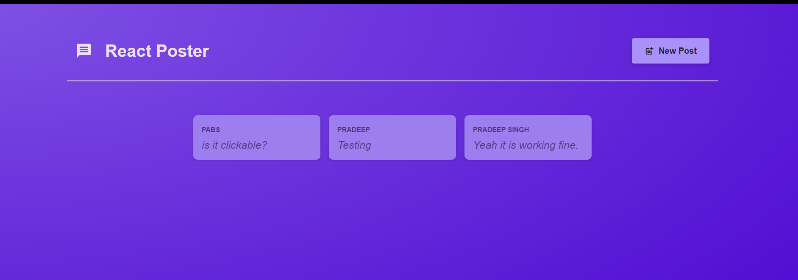

# React Poster App

A simple full-stack React application where users can create and view posts in a Twitter/X-style feed.

This project demonstrates modern React development using React Router's Data APIs (Loaders and Actions) along with a simple Node.js backend.

---

## Features

- View all posts
- Create a new post
- View individual post details
- Modal-based post creation
- Fetch data from a backend API
- React Router Data APIs
- Responsive card layout

---

## Tech Stack

### Frontend

- React
- React Router DOM
- CSS Modules
- Fetch API

### Backend

- Node.js
- Express
- JSON File Storage

---

## Project Structure

```
react-poster-app/
│
├── dummy-backend/
│   ├── app.js
│   ├── posts.json
│   └── package.json
│
└── starting-project/
    ├── src/
    ├── public/
    └── package.json
```

---

## Installation

### 1. Clone the repository

```bash
git clone https://github.com/your-username/react-poster-app.git
```

---

### 2. Install backend dependencies

```bash
cd dummy-backend
npm install
```

---

### 3. Start the backend

```bash
npm start
```

The backend runs on:

```
http://localhost:8080
```

---

### 4. Install frontend dependencies

```bash
cd ../starting-project
npm install
```

---

### 5. Start the frontend

```bash
npm run dev
```

The application runs on:

```
http://localhost:5173
```

---

## React Concepts Used

- Functional Components
- Component Composition
- Props
- React Router
- Nested Routes
- Loaders
- Actions
- Forms
- Navigation
- Fetch API
- State Management

---

## Future Improvements

- User authentication
- Likes and reactions
- Comments
- Edit/Delete posts
- Database integration (MongoDB/PostgreSQL)
- Pagination
- Search functionality

---

## Screenshot

Home Page


---

## License

This project is created for learning and practice purposes.
